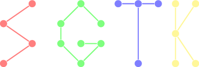

 

**Small Graphs Toolkit (SGTK)** is a Rust library for efficently working with
small graphs. This libarary has been developed for the purpose of effectivly
searching for torus obstructions. This library and its accomponying tools
should be useful for others working on the same problem and might also be
useful for other problems in computational  graph enumeration.

The most complete list of known torus obstructions is available from [Wendy
Myrvold's page][1]. `f4m/all-new.txt` is the list of previously unknown
obsturctions that have been found with the tools in this repo, they have not
yet been added to Myrvold's list.

The `f4m` folder contains a selection of tools to help with this. The `ffi`
folder contains the implemntation of a simple algorithm that can be combined
with the `geng` graph enumeration tool by Brendan McKay to enumerate torus
obstructions.

SGTK has graph types that are optimized for graphs with at most 16, at most 32
and at most 64 vertices. The graph type optimized for at most 16 vertices fits
in a 256-bit AVX2 register and has some operations that are hand-optimized for
AVX2. Additionaly there is a implementation of rotation systems for expressing
graph embeddings. The rotation systems support useful operations like computing
faces, embedding a path into a face and, enumerating all rotation systems given
a graph.

Most notably implementations for the following algorithms are provided:

- The DMP plane embedding algorithm introduced in: G Demoucron, Y Malgrange,
  and R Pertuiset. “Graphes planaires”. In: Rev. Fran caise Recherche Op
  erationnelle 8 (1964), pp. 33–47.
- The torus embedding algorithm introduced in: Jennifer Woodcock. “A simpler and faster
  algorithm for torus embedding”. MA thesis. University of Victoria, 2006.
- The graph isomorphism testing algorithm introduced in: Brendan D McKay
  and Adolfo Piperno. “Practical graph isomorphism, II”. In: Journal of Symbolic
  Computation 60 (2014), pp. 94–112.

[1]: http://webhome.cs.uvic.ca/~wendym/torus/torus_obstructions.html
